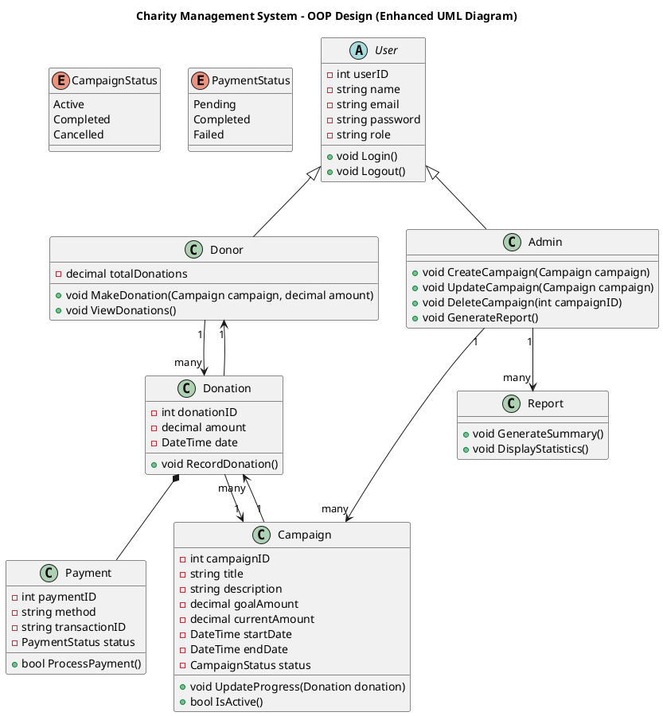

# Charity Management System - OOP Design

## Overview
This project represents a **Charity Management System** designed using Object-Oriented Programming (OOP) principles. It uses UML to visually represent the system's structure, including classes, relationships, and core functionalities.

## UML Diagram
The UML diagram defines the main entities, their attributes, methods, and relationships.

## Key Classes

### User (Abstract)
Represents a generic system user. Both `Donor` and `Admin` inherit from `User`.

### Donor
Handles donation-related actions.

### Admin
Manages campaigns and generates reports.

### Campaign
Represents a charity campaign with goal amounts, progress, and status.

### Donation
Tracks donations made by donors and links to payments.

### Payment
Processes financial transactions.

### Report
Generates summaries and statistics for campaigns.

## Relationships
- **Donor → Donation**: One donor can make multiple donations.
- **Campaign → Donation**: One campaign can receive multiple donations.
- **Donation → Payment**: Each donation requires a payment (composition).
- **Donation → Donor/Campaign**: Each donation references its donor and campaign.
- **Admin → Campaign**: Admin can manage multiple campaigns.
- **Admin → Report**: Admin can generate multiple reports.

###-- Database: CharityManagementSystem

-- Table: Users
CREATE TABLE Users (
    user_id INT AUTO_INCREMENT PRIMARY KEY,
    name VARCHAR(255) NOT NULL,
    email VARCHAR(255) NOT NULL UNIQUE,
    password VARCHAR(255) NOT NULL,
    role ENUM('donor','admin') NOT NULL
);

-- Table: Campaigns
CREATE TABLE Campaigns (
    campaign_id INT AUTO_INCREMENT PRIMARY KEY,
    title VARCHAR(255) NOT NULL,
    description TEXT,
    goal_amount DECIMAL(10,2) NOT NULL,
    current_amount DECIMAL(10,2) DEFAULT 0,
    start_date DATE NOT NULL,
    end_date DATE NOT NULL,
    status ENUM('Active','Completed','Cancelled') NOT NULL,
    admin_id INT NOT NULL,
    FOREIGN KEY (admin_id) REFERENCES Users(user_id) ON DELETE CASCADE
);

-- Table: Donations
CREATE TABLE Donations (
    donation_id INT AUTO_INCREMENT PRIMARY KEY,
    donor_id INT NOT NULL,
    campaign_id INT NOT NULL,
    amount DECIMAL(10,2) NOT NULL,
    donation_date DATETIME DEFAULT CURRENT_TIMESTAMP,
    FOREIGN KEY (donor_id) REFERENCES Users(user_id) ON DELETE CASCADE,
    FOREIGN KEY (campaign_id) REFERENCES Campaigns(campaign_id) ON DELETE CASCADE
);

-- Table: Payments
CREATE TABLE Payments (
    payment_id INT AUTO_INCREMENT PRIMARY KEY,
    donation_id INT NOT NULL UNIQUE,
    method VARCHAR(50) NOT NULL,
    transaction_id VARCHAR(255) NOT NULL UNIQUE,
    status ENUM('Pending','Completed','Failed') NOT NULL,
    FOREIGN KEY (donation_id) REFERENCES Donations(donation_id) ON DELETE CASCADE
);

-- Table: Reports
CREATE TABLE Reports (
    report_id INT AUTO_INCREMENT PRIMARY KEY,
    admin_id INT NOT NULL,
    title VARCHAR(255) NOT NULL,
    generated_at DATETIME DEFAULT CURRENT_TIMESTAMP,
    content TEXT,
    FOREIGN KEY (admin_id) REFERENCES Users(user_id) ON DELETE CASCADE
);

## Notes
- `Campaign.status` and `Payment.status` use enumerations for type safety.
- Methods and attributes illustrate main operations and can be extended in implementation.
- This UML serves as a blueprint for implementing the Charity Management System in OOP languages like C#, Java, or PHP.

