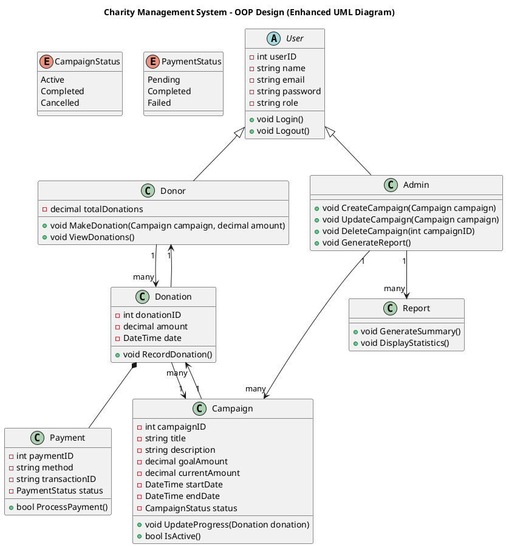

# Charity Management System - OOP Design

## Overview
This project represents a **Charity Management System** designed using Object-Oriented Programming (OOP) principles. It uses UML to visually represent the system's structure, including classes, relationships, and core functionalities.

## UML Diagram
The UML diagram defines the main entities, their attributes, methods, and relationships.

## Key Classes

### User (Abstract)
Represents a generic system user. Both `Donor` and `Admin` inherit from `User`.

### Donor
Handles donation-related actions.

### Admin
Manages campaigns and generates reports.

### Campaign
Represents a charity campaign with goal amounts, progress, and status.

### Donation
Tracks donations made by donors and links to payments.

### Payment
Processes financial transactions.

### Report
Generates summaries and statistics for campaigns.

## Relationships
- **Donor → Donation**: One donor can make multiple donations.
- **Campaign → Donation**: One campaign can receive multiple donations.
- **Donation → Payment**: Each donation requires a payment (composition).
- **Donation → Donor/Campaign**: Each donation references its donor and campaign.
- **Admin → Campaign**: Admin can manage multiple campaigns.
- **Admin → Report**: Admin can generate multiple reports.

## Notes
- `Campaign.status` and `Payment.status` use enumerations for type safety.
- Methods and attributes illustrate main operations and can be extended in implementation.
- This UML serves as a blueprint for implementing the Charity Management System in OOP languages like C#, Java, or PHP.

